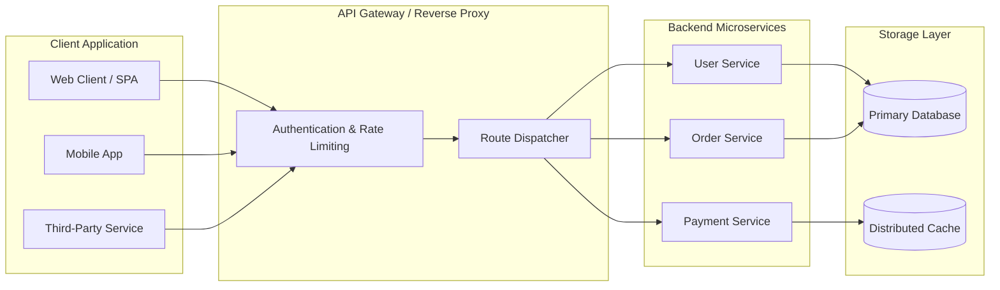
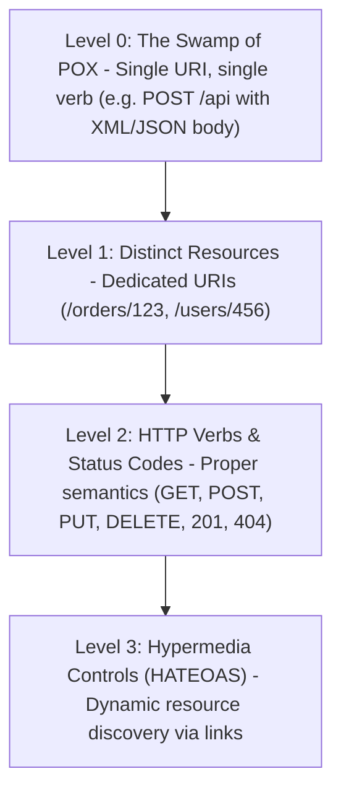
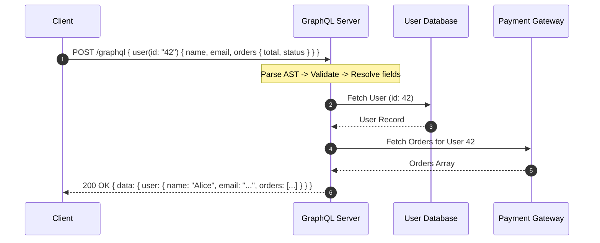
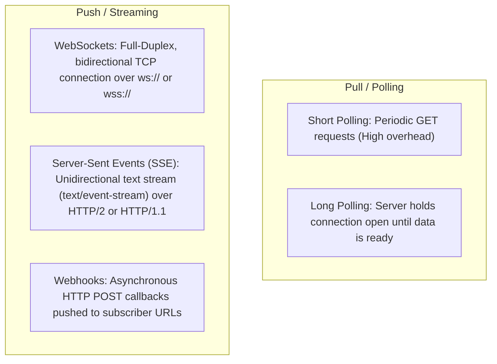
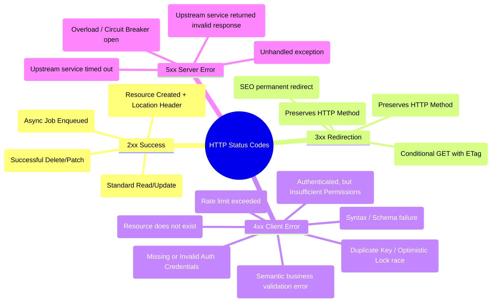
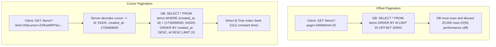
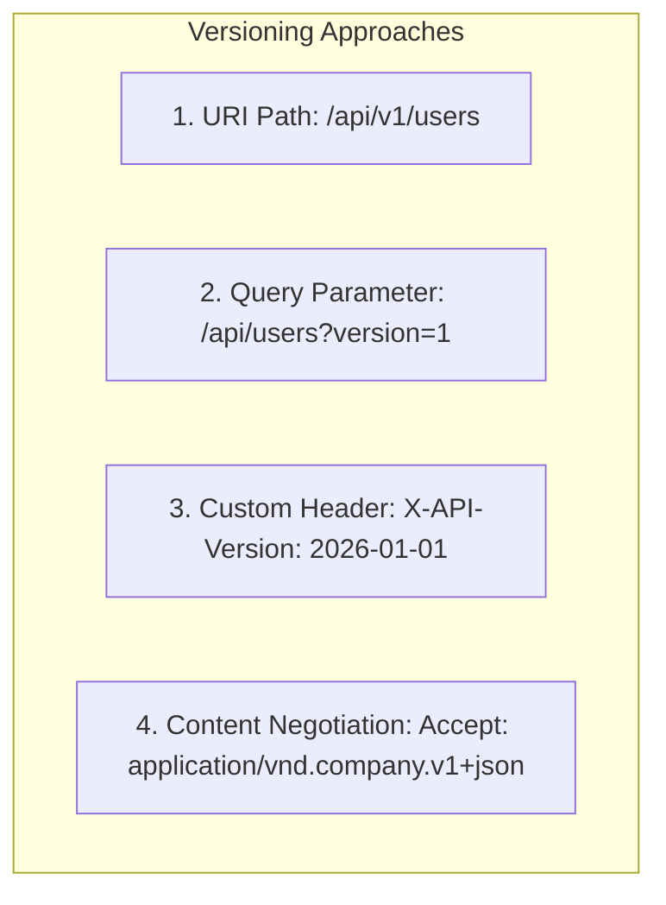
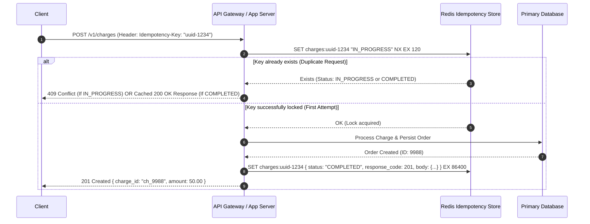

# API Architecture, Design Principles, and Protocols: The Definitive Guide

> An exhaustive, production-grade guide to Application Programming Interfaces (APIs), covering modern architectural paradigms, RESTful design standards, gRPC, GraphQL, WebSockets, advanced query patterns, HTTP semantics, versioning, security, and idempotency.

---

## Table of Contents
1. [API Fundamentals and Architecture](#1-api-fundamentals-and-architecture)
2. [API Paradigms and Communication Protocols](#2-api-paradigms-and-communication-protocols)
   - [REST (Representational State Transfer)](#rest-representational-state-transfer)
   - [GraphQL (Query-Driven API)](#graphql-query-driven-api)
   - [gRPC (Remote Procedure Calls with Protocol Buffers)](#grpc-remote-procedure-calls-with-protocol-buffers)
   - [Event-Driven Protocols: WebSockets, SSE, and Webhooks](#event-driven-protocols-websockets-sse-and-webhooks)
   - [Exhaustive Protocol Comparison](#exhaustive-protocol-comparison)
3. [RESTful API Design Standards and Best Practices](#3-restful-api-design-standards-and-best-practices)
   - [Resource Modeling and URI Conventions](#resource-modeling-and-uri-conventions)
   - [HTTP Methods and Idempotency Semantics](#http-methods-and-idempotency-semantics)
   - [HTTP Status Codes Reference Matrix](#http-status-codes-reference-matrix)
   - [Standardized Error Handling (RFC 7807 / RFC 9457)](#standardized-error-handling-rfc-7807--rfc-9457)
4. [Advanced Query Patterns](#4-advanced-query-patterns)
   - [Filtering and Searching](#filtering-and-searching)
   - [Sorting](#sorting)
   - [Field Selection (Sparse Fieldsets)](#field-selection-sparse-fieldsets)
   - [Pagination Strategies: Offset vs Cursor vs Keyset](#pagination-strategies-offset-vs-cursor-vs-keyset)
5. [API Versioning Strategies](#5-api-versioning-strategies)
6. [Idempotency in Distributed Systems](#6-idempotency-in-distributed-systems)
7. [API Security, Rate Limiting, and Governance](#7-api-security-rate-limiting-and-governance)
8. [API Design Lifecycle: Design-First vs Code-First](#8-api-design-lifecycle-design-first-vs-code-first)
9. [Complete Real-World Implementation Examples](#9-complete-real-world-implementation-examples)

---

## 1. API Fundamentals and Architecture

An **Application Programming Interface (API)** is a formal contractual interface and protocol suite that allows independent software systems to communicate, exchange data, and execute operations across network boundaries without exposing internal underlying implementation details.



### Core Tenets of Robust API Architecture

- **Contract-Driven Decoupling**: Clients and servers evolve independently as long as the interface contract (OpenAPI, Protobuf schema, GraphQL SDL) remains backward-compatible.
- **Abstraction & Encapsulation**: Internal database schemas, caching topologies, and language choices remain strictly hidden behind clean boundary interfaces.
- **Fault Isolation & Resiliency**: API interfaces implement timeouts, circuit breakers, and graceful degradation to prevent cascading upstream failures.
- **Observability**: Every interaction emits structured telemetry (distributed trace IDs like `X-Trace-Id` or W3C `traceparent`, latency metrics, and structured logs).

---

## 2. API Paradigms and Communication Protocols

### REST (Representational State Transfer)

Defined by Roy Fielding in 2000, REST is an architectural style based on web standards, treating everything as a **Resource** addressed via unique URIs and manipulated using standard HTTP verbs.

#### The Richardson Maturity Model (RMM)



#### REST Architectural Constraints
1. **Statelessness**: Every request contains all context needed by the server. The server stores no client session context between requests.
2. **Client-Server Architecture**: Separation of user interface concerns from data storage concerns.
3. **Cacheability**: Responses explicitly declare their cacheability via HTTP headers (`Cache-Control`, `ETag`, `Last-Modified`).
4. **Uniform Interface**: Consistent resource identification, manipulation through representations, self-descriptive messages, and hypermedia (HATEOAS).
5. **Layered System**: Clients cannot determine whether they are connected directly to the end server or to an intermediary proxy/CDN.

---

### GraphQL (Query-Driven API)

Developed by Facebook in 2012 (open-sourced in 2015), GraphQL provides a strongly typed query language and runtime engine that executes queries against a type system defined by a schema.



#### GraphQL Strengths vs Weaknesses
- **Eliminates Over-fetching**: Clients request only fields they need (reduces payload size over cellular networks).
- **Eliminates Under-fetching**: Aggregates data from multiple backend services in a single round-trip.
- **Challenges**: Complex HTTP-level caching (everything is typically `POST /graphql`), vulnerability to nested denial-of-service queries (requires query depth limiting and cost analysis), and the **N+1 query problem** (solved using batch loaders like DataLoader).

---

### gRPC (Remote Procedure Calls with Protocol Buffers)

Developed by Google, gRPC is an open-source RPC framework that operates over **HTTP/2** and uses **Protocol Buffers (Protobuf)** as its Interface Definition Language (IDL) and binary serialization format.

```protobuf
syntax = "proto3";

package commerce.v1;

service OrderService {
  rpc GetOrder (GetOrderRequest) returns (OrderResponse);
  rpc StreamOrderUpdates (OrderSubscription) returns (stream OrderStatusUpdate);
}

message GetOrderRequest {
  string order_id = 1;
}

message OrderResponse {
  string order_id = 1;
  string customer_id = 2;
  double total_amount = 3;
  enum Status {
    PENDING = 0;
    PROCESSING = 1;
    SHIPPED = 2;
    DELIVERED = 3;
  }
  Status status = 4;
}

message OrderSubscription {
  string order_id = 1;
}

message OrderStatusUpdate {
  string order_id = 1;
  string status = 2;
  int64 timestamp_epoch_ms = 3;
}
```

#### gRPC Key Advantages
- **Binary Serialization**: Protobuf is 5-10x smaller and 5-20x faster to serialize/deserialize than JSON.
- **HTTP/2 Transport**: Native header compression (HPACK), request multiplexing over a single TCP connection, and bi-directional streaming.
- **Strict Typing & Auto-generated SDKs**: Code generation for C++, Go, Java, Python, TypeScript, Rust, and C#.

---

### Event-Driven Protocols: WebSockets, SSE, and Webhooks



1. **WebSockets (RFC 6455)**: Upgrade from HTTP (`101 Switching Protocols`) to persistent bidirectional TCP socket. Ideal for chat, gaming, financial tickers.
2. **Server-Sent Events (SSE)**: Standard HTTP connection where server pushes newline-delimited events (`data: {...}\n\n`). Built-in reconnection in browsers, lightweight, HTTP/2 multiplexed.
3. **Webhooks**: Event publishers trigger asynchronous HTTP POST requests to consumer endpoints upon state changes (e.g., Stripe payment confirmation, GitHub push event).

---

### Exhaustive Protocol Comparison

| Dimension | REST | GraphQL | gRPC | WebSockets | Server-Sent Events (SSE) |
| :--- | :--- | :--- | :--- | :--- | :--- |
| **Primary Paradigm** | Resource-Oriented | Query/Graph-Oriented | Action/RPC-Oriented | Bidirectional Socket | Unidirectional Stream |
| **Transport Protocol** | HTTP/1.1, HTTP/2, HTTP/3 | HTTP/1.1, HTTP/2 | HTTP/2, HTTP/3 | TCP (WebSocket frame) | HTTP/1.1, HTTP/2 |
| **Data Serialization** | JSON, XML, MessagePack | JSON | Protocol Buffers (Binary) | JSON, Binary, Text | UTF-8 Text / Event Stream |
| **Client Control** | Fixed response contract | Exact field selection | Fixed contract via Protobuf | Custom message framing | Server-driven stream |
| **HTTP Caching** | Native (`Cache-Control`, `ETag`) | Complex (Client-side cache) | None (Custom cache layer) | Not applicable | Standard HTTP caching |
| **Network Overhead** | Moderate (Headers + JSON) | Moderate to High | Minimal (Binary + HPACK) | Extremely low post-handshake | Low |
| **Browser Support** | Universal | Universal | Requires gRPC-Web proxy | Universal | Universal |
| **Best Use Case** | Public APIs, CRUD services | Dashboards, Mobile apps | Microservice mesh, Real-time RPC | Chat, collaborative apps | Live metrics, notifications |

---

## 3. RESTful API Design Standards and Best Practices

### Resource Modeling and URI Conventions

A clean URI design communicates system topology and hierarchy intuitively.

#### Core Rules for URI Design

1. **Use Nouns, Not Verbs**: Resources are entities, not actions.
   - ❌ `GET /api/getAllUsers`
   - ❌ `POST /api/createUser`
   - ❌ `POST /api/deleteUser?id=123`
   - ✅ `GET /api/v1/users`
   - ✅ `POST /api/v1/users`
   - ✅ `DELETE /api/v1/users/123`

2. **Use Plural Nouns for Collections**:
   - ✅ `/api/v1/products` (Collection)
   - ✅ `/api/v1/products/45` (Specific resource instance)

3. **Represent Hierarchical Sub-Resources Cleanly**:
   - Limit nesting depth to **maximum 2 levels** to prevent runaway URI lengths:
   - ✅ `GET /api/v1/users/42/orders` (Orders belonging to User 42)
   - ✅ `GET /api/v1/orders/998/items` (Items belonging to Order 998)
   - ❌ `GET /api/v1/companies/1/departments/2/teams/3/members/4/tasks/5` (Too deep; flatten to `/api/v1/tasks?member_id=4`)

4. **Use Kebab-Case for URIs and CamelCase/Snake_Case for JSON Keys**:
   - ✅ `GET /api/v1/payment-methods` (URI uses kebab-case)
   - ✅ JSON Body: `{"cardHolderName": "Alice", "billingAddress": "..."}`

5. **Controller Actions (Exceptions for Non-CRUD Actions)**:
   - For state transitions or business processes that don't map cleanly to CRUD, use explicit verb endpoints formatted as sub-resources:
   - ✅ `POST /api/v1/accounts/123/lock`
   - ✅ `POST /api/v1/orders/998/cancel`
   - ✅ `POST /api/v1/reports/export`

---

### HTTP Methods and Idempotency Semantics

Understanding the RFC 9110 specification for **Safe** and **Idempotent** operations is critical for reliable distributed architecture:

- **Safe**: Calling the method produces no side effects or mutations on the server resource state.
- **Idempotent**: Calling the method $N$ times consecutively produces the exact same server resource state as calling it once.

```
                  +----------------------------------------------------+
                  |               HTTP Method Semantics                |
+--------+--------+----------------+----------------+------------------+
| Method | RFC    | Safe (Read)    | Idempotent     | Typical Success  |
+--------+--------+----------------+----------------+------------------+
| GET    | 9110   | YES            | YES            | 200 OK           |
| HEAD   | 9110   | YES            | YES            | 200 OK (No Body) |
| OPTIONS| 9110   | YES            | YES            | 204 / 200 OK     |
| POST   | 9110   | NO             | NO             | 201 Created      |
| PUT    | 9110   | NO             | YES (Full Repl)| 200 OK / 204     |
| PATCH  | 5789   | NO             | NO* (Partial)  | 200 OK / 204     |
| DELETE | 9110   | NO             | YES            | 200 OK / 204     |
+--------+--------+----------------+----------------+------------------+
* Note: PATCH can be designed to be idempotent depending on the operations payload.
```

#### Detailed Method Behaviors

- **`GET /resources`**: Retrieves representation. Must never alter backend data.
- **`POST /resources`**: Creates a new subordinate resource. Server generates the ID and returns `201 Created` with a `Location: /resources/{id}` header.
- **`PUT /resources/{id}`**: Replaces the entire resource state at the specific URI. If optional fields are omitted in the request body, they must be set to default/null.
- **`PATCH /resources/{id}`**: Partial update. Modifies only the specified attributes:
  - **JSON Merge Patch (RFC 7396)**: Sending `{"email": "new@domain.com"}` updates only the email.
  - **JSON Patch (RFC 6902)**: Formal array of patch operations:
    ```json
    [
      { "op": "replace", "path": "/email", "value": "new@domain.com" },
      { "op": "remove", "path": "/phoneNumber" }
    ]
    ```
- **`DELETE /resources/{id}`**: Removes the resource. First call returns `200 OK` or `204 No Content`. Subsequent identical calls return `404 Not Found` (or `204`), but the server state remains unchanged (idempotent).

---

### HTTP Status Codes Reference Matrix



---

### Standardized Error Handling (RFC 7807 / RFC 9457)

Inconsistent error responses force clients to write custom parsing code for every endpoint. Industry best practice is to adopt **RFC 7807 / RFC 9457: Problem Details for HTTP APIs** (`Content-Type: application/problem+json`).

```http
HTTP/1.1 422 Unprocessable Entity
Content-Type: application/problem+json
Content-Language: en

{
  "type": "https://api.example.com/errors/insufficient-funds",
  "title": "Insufficient Funds",
  "status": 422,
  "detail": "Account balance of $120.50 is insufficient for requested withdrawal of $500.00.",
  "instance": "/api/v1/accounts/acc_98765/withdrawals",
  "invalid_params": [
    {
      "name": "amount",
      "reason": "Must be less than or equal to current available balance ($120.50)"
    }
  ],
  "trace_id": "req_01HP8XYZ456ABCK987"
}
```

---

## 4. Advanced Query Patterns

### Filtering and Searching

```http
GET /api/v1/orders?status=shipped&payment_method=credit_card&created_after=2026-01-01
```

For advanced comparison operations, use standard bracket notation (LHS) or colon operators (RHS):

| Pattern | Example Syntax | Generated SQL Clause |
| :--- | :--- | :--- |
| **Equality** | `status=active` | `WHERE status = 'active'` |
| **Greater than or equal** | `price[gte]=100` or `price=gte:100` | `WHERE price >= 100` |
| **Less than** | `stock[lt]=10` or `stock=lt:10` | `WHERE stock < 10` |
| **In Set** | `category[in]=tech,apparel` | `WHERE category IN ('tech', 'apparel')` |
| **Wildcard / Like** | `title[like]=*laptop*` | `WHERE title ILIKE '%laptop%'` |

---

### Sorting

Enable multi-column sorting using a comma-delimited `sort` parameter. Prefix with `-` or descending indicator:

```http
GET /api/v1/products?sort=-created_at,price
```
*Meaning: Sort primarily by `created_at` descending (newest first), and secondarily by `price` ascending.*

---

### Field Selection (Sparse Fieldsets)

To reduce bandwidth and optimize database projections, allow clients to select specific fields:

```http
GET /api/v1/users?fields=id,first_name,email,avatar_url
```

---

### Pagination Strategies: Offset vs Cursor vs Keyset



#### Comprehensive Pagination Comparison

| Feature | Offset-Based (`page`, `limit`) | Keyset / Cursor-Based (`cursor`, `limit`) |
| :--- | :--- | :--- |
| **Implementation** | `OFFSET (page - 1) * limit` | `WHERE id > :last_seen_id ORDER BY id ASC` |
| **Performance** | $O(N)$ — Disastrous at high page numbers | $O(1)$ — High-speed B-Tree index lookup |
| **Data Drift Resiliency**| **Vulnerable**: Adding/deleting rows causes duplicate or skipped records | **Resilient**: Cursor points to exact deterministic point in stream |
| **Random Page Jump** | Supported (`Jump to Page 45`) | Not supported (Sequential navigation only) |
| **Best Used For** | Small admin panels, static catalogs | Social feeds, infinite scroll, high-volume public APIs |

#### Standard Response Format with Cursor Metadata

```json
{
  "data": [
    { "id": "prod_101", "name": "Mechanical Keyboard", "price": 149.99 },
    { "id": "prod_102", "name": "Ergonomic Mouse", "price": 89.99 }
  ],
  "pagination": {
    "limit": 2,
    "has_more": true,
    "next_cursor": "eyJpZCI6InByb2RfMTAyIiwidHMiOjE3MzU2ODkwMDB9",
    "prev_cursor": null
  },
  "links": {
    "self": "https://api.example.com/v1/products?limit=2",
    "next": "https://api.example.com/v1/products?limit=2&cursor=eyJpZCI6InByb2RfMTAyIiwidHMiOjE3MzU2ODkwMDB9"
  }
}
```

---

## 5. API Versioning Strategies

APIs must evolve without breaking existing client integrations.



| Strategy | Syntax Example | Pros | Cons | Recommendation |
| :--- | :--- | :--- | :--- | :--- |
| **URI Path** | `/api/v1/orders` | Explicit, easy to test in browsers, simple caching | Clutters URI space, violates pure REST abstraction | **Recommended for General Public APIs** |
| **Date-Based Header** | `Stripe-Version: 2026-03-01` | Keeps URIs clean, granular field transformations | Requires gateway header routing, harder to test via browser | **Recommended for Large SaaS Platforms** (e.g. Stripe) |
| **Content Negotiation** | `Accept: application/vnd.myapi.v2+json` | Strictly adheres to REST HATEOAS standards | Difficult to inspect, complex proxy caching rules | Recommended for strict Hypermedia architectures |
| **Query Parameter** | `/api/orders?v=2` | Simple implementation | CDN cache key fragmentation, looks informal | Avoid for enterprise systems |

---

## 6. Idempotency in Distributed Systems

In distributed networks, transient network timeouts cause clients to retry requests. If a non-idempotent `POST /api/v1/charges` request is retried, the customer may be charged twice.

### The Idempotency Key Architecture



---

## 7. API Security, Rate Limiting, and Governance

### Modern Rate Limiting Algorithms

1. **Token Bucket**: Tokens are added to a bucket at a constant rate $R$ up to capacity $B$. Each request consumes 1 token. Allows controlled traffic bursts while enforcing an average rate limit.
2. **Leaky Bucket**: Requests enter a queue and leak out at a constant rate. Smooths out traffic spikes into steady processing.
3. **Sliding Window Counter**: Hybrid algorithm combining fixed window counters with a time-weighted calculation. Prevents double-rate spikes at window boundaries with minimal Redis memory consumption.

#### Standard Rate Limiting Response Headers (IETF Draft)

```http
HTTP/1.1 429 Too Many Requests
Content-Type: application/problem+json
RateLimit-Limit: 1000
RateLimit-Remaining: 0
RateLimit-Reset: 35
Retry-After: 35

{
  "type": "https://api.example.com/errors/rate-limit-exceeded",
  "title": "Too Many Requests",
  "status": 429,
  "detail": "Quota exceeded. Allowed 1000 requests per 60 seconds. Retry in 35 seconds."
}
```

---

## 8. API Design Lifecycle: Design-First vs Code-First

```mermaid
flowchart LR
    subgraph Design-First (Recommended)
        D1["1. Write OpenAPI 3.1 Specification (YAML/JSON)"]
        D2["2. Mock Server (Prism / WireMock)"]
        D3["3. Contract Review with Frontend & Mobile Teams"]
        D4["4. Backend Implementation & Automated Dredd / Schemathesis Testing"]
        D1 --> D2 --> D3 --> D4
    end
```

### Design-First Benefits
- **Zero Frontend Blocking**: Frontend teams mock endpoints against the OpenAPI contract on Day 1.
- **Strict Contract Enforcement**: Automatic validation of incoming requests and outgoing responses against the spec.
- **Automated SDK Generation**: Generate client SDKs in TypeScript, Python, Swift, and Kotlin using tools like OpenAPI Generator or Stainless.

---

## 9. Complete Real-World Implementation Examples

### Standard RESTful Express.js Implementation (Node.js & TypeScript)

```typescript
import express, { Request, Response, NextFunction } from 'express';

const app = express();
app.use(express.json());

interface Product {
  id: string;
  name: string;
  price: number;
  category: string;
  createdAt: string;
}

const productDatabase: Map<string, Product> = new Map();

// GET /api/v1/products - Filtered, Sorted, Paginated
app.get('/api/v1/products', (req: Request, res: Response) => {
  const { category, minPrice, limit = '10', cursor } = req.query;
  const pageSize = Math.min(parseInt(limit as string, 10) || 10, 50);

  let products = Array.from(productDatabase.values());

  // 1. Filtering
  if (category) {
    products = products.filter(p => p.category === category);
  }
  if (minPrice) {
    products = products.filter(p => p.price >= parseFloat(minPrice as string));
  }

  // 2. Keyset / Cursor Pagination (ID based)
  if (cursor) {
    const decodedId = Buffer.from(cursor as string, 'base64').toString('ascii');
    const index = products.findIndex(p => p.id === decodedId);
    if (index !== -1) {
      products = products.slice(index + 1);
    }
  }

  const items = products.slice(0, pageSize);
  const nextItem = products[pageSize];
  const nextCursor = nextItem ? Buffer.from(nextItem.id).toString('base64') : null;

  res.status(200).json({
    data: items,
    pagination: {
      limit: pageSize,
      has_more: !!nextItem,
      next_cursor: nextCursor
    }
  });
});

// POST /api/v1/products - Resource Creation
app.post('/api/v1/products', (req: Request, res: Response, next: NextFunction) => {
  const { name, price, category } = req.body;

  if (!name || price === undefined || !category) {
    return res.status(422).json({
      type: "https://api.example.com/errors/validation-error",
      title: "Validation Error",
      status: 422,
      detail: "Mandatory fields 'name', 'price', and 'category' are required."
    });
  }

  const id = `prod_${Date.now()}`;
  const newProduct: Product = {
    id,
    name,
    price: Number(price),
    category,
    createdAt: new Date().toISOString()
  };

  productDatabase.set(id, newProduct);

  res.status(201)
     .location(`/api/v1/products/${id}`)
     .json(newProduct);
});
```

---

> [!TIP]
> **Summary Checklist for Production APIs**:
> - ✅ Keep URIs plural, noun-based, and consistent (`/api/v1/resources`).
> - ✅ Obey HTTP verb semantics and idempotency guarantees.
> - ✅ Return RFC 7807/9457 `application/problem+json` formatted errors.
> - ✅ Implement cursor-based pagination for large and dynamically updating datasets.
> - ✅ Enforce rate limiting with explicit standard headers (`RateLimit-Limit`, `RateLimit-Remaining`).
> - ✅ Adopt a Design-First workflow with OpenAPI 3.1 contracts.
