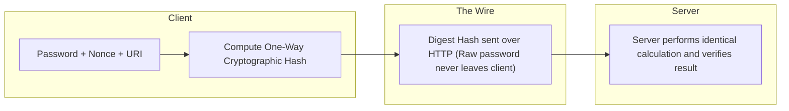
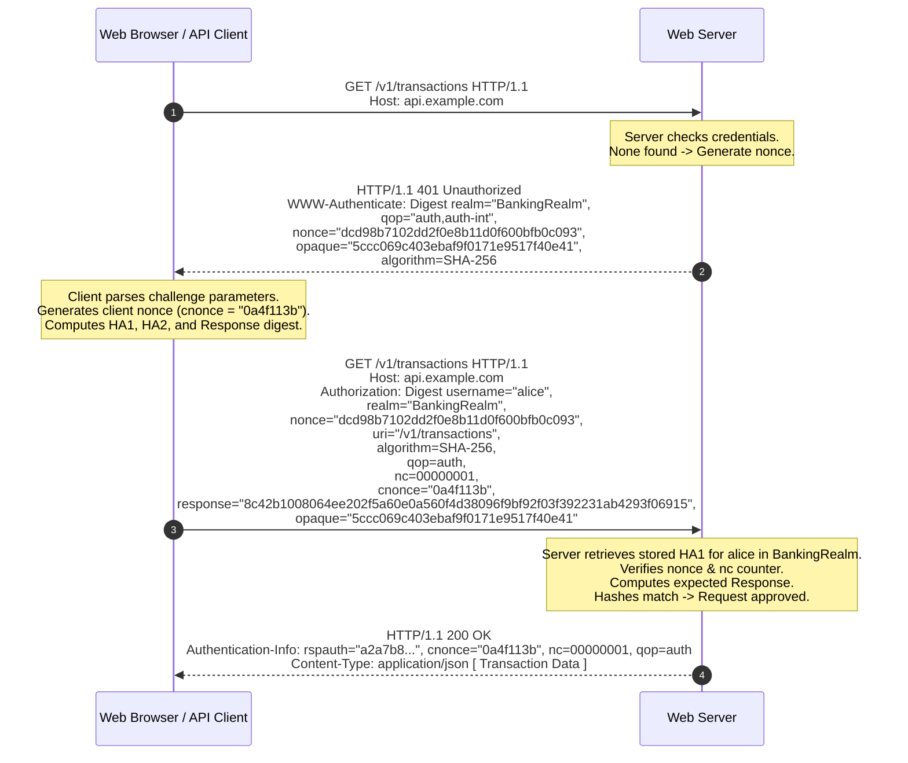

# HTTP Digest Access Authentication: Cryptographic Architecture and RFC Analysis

> A comprehensive deep-dive into HTTP Digest Authentication ([RFC 2617](https://datatracker.ietf.org/doc/html/rfc2617) / [RFC 7616](https://datatracker.ietf.org/doc/html/rfc7616)), the cryptographic hash formulas (HA1, HA2, Response), replay-attack prevention, and why it became obsolete in modern architectures.

---

## Table of Contents
1. [What is HTTP Digest Authentication?](#1-what-is-http-digest-authentication)
2. [Key Cryptographic Parameters](#2-key-cryptographic-parameters)
3. [The Mathematical Hash Computation (HA1, HA2, and Response)](#3-the-mathematical-hash-computation-ha1-ha2-and-response)
   - [Computation of HA1 (Identity Hash)](#computation-of-ha1-identity-hash)
   - [Computation of HA2 (Request Context Hash)](#computation-of-ha2-request-context-hash)
   - [Computation of Final Digest Response](#computation-of-final-digest-response)
4. [End-to-End Protocol Flow and Wire Headers](#4-end-to-end-protocol-flow-and-wire-headers)
5. [Replay Attack Mitigation: Nonces and Nonce Counting (nc)](#5-replay-attack-mitigation-nonces-and-nonce-counting-nc)
6. [Mutual Authentication: The `Authentication-Info` Header](#6-mutual-authentication-the-authentication-info-header)
7. [The Fatal Flaw: Server-Side Password Storage Vulnerability](#7-the-fatal-flaw-server-side-password-storage-vulnerability)
8. [Digest Auth vs. Basic Auth vs. Bearer Tokens](#8-digest-auth-vs-basic-auth-vs-bearer-tokens)
9. [Complete Node.js / TypeScript Verification Implementation](#9-complete-nodejs--typescript-verification-implementation)

---

## 1. What is HTTP Digest Authentication?

**HTTP Digest Access Authentication** was introduced to solve the primary vulnerability of Basic Authentication: transmitting passwords in plain text or easily reversible Base64 over the wire.

Instead of sending the password, Digest Authentication uses a **challenge-response mechanism** based on one-way cryptographic hashing (historically **MD5**, updated to **SHA-256** and **SHA-512-256** in RFC 7616). The client demonstrates possession of the secret password by computing a hash over the credentials, a server-provided **nonce** (number used once), and the HTTP request metadata.



---

## 2. Key Cryptographic Parameters

When executing Digest Authentication, the client and server exchange structured parameters:

| Parameter | Origin | Description | Example Value |
| :--- | :--- | :--- | :--- |
| `username` | Client | The account username | `"alice"` |
| `realm` | Server | The authentication domain / protection space | `"Restricted Financial API"` |
| `nonce` | Server | A cryptographically generated random token, typically timestamped | `"dcd98b7102dd2f0e8b11d0f600bfb0c093"` |
| `uri` | Client | The request URI path being accessed | `"/v1/accounts/12345"` |
| `qop` | Server/Client | Quality of Protection: `"auth"` (auth only) or `"auth-int"` (auth + body integrity) | `"auth"` |
| `nc` | Client | Nonce Count: 8-digit hexadecimal counter tracking nonce reuse | `00000001` |
| `cnonce` | Client | Client Nonce: Client-generated random string preventing chosen-plaintext attacks | `"0a4f113b"` |
| `algorithm` | Server | Hash function used (MD5, SHA-256, SHA-512-256) | `"SHA-256"` |
| `opaque` | Server | State string echoed back verbatim by the client | `"5ccc069c403ebaf9f0171e9517f40e41"` |
| `response` | Client | The computed cryptographic digest string proving credential possession | `"6629fae49393a05397450978507c4ef1"` |

---

## 3. The Mathematical Hash Computation (HA1, HA2, and Response)

The RFC specification standardizes three sequential hashing stages:

```mermaid
flowchart TD
    subgraph Stage 1: HA1 (User Identity)
        U["username"] --- R["realm"] --- P["password"]
        U & R & P --> H1["Hash(username : realm : password)"] --> HA1["HA1 Value"]
    end

    subgraph Stage 2: HA2 (Request Context)
        M["HTTP Method (GET/POST)"] --- URI["Digest URI (/v1/data)"]
        M & URI --> H2["Hash(method : uri)"] --> HA2["HA2 Value"]
    end

    subgraph Stage 3: Final Response Digest
        HA1 --- N["nonce"] --- NC["nc (00000001)"] --- CN["cnonce"] --- QOP["qop (auth)"] --- HA2
        HA1 & N & NC & CN & QOP & HA2 --> H3["Hash(HA1 : nonce : nc : cnonce : qop : HA2)"] --> Final["Final 'response' Digest"]
    end
```

### Computation of HA1 (Identity Hash)

For `algorithm="SHA-256"`:
$$\text{HA1} = H(\text{username} : \text{realm} : \text{password})$$

*For session-variant algorithms (`algorithm="SHA-256-sess"`), HA1 incorporates the nonces to limit hash lifetime:*
$$\text{HA1} = H(H(\text{username} : \text{realm} : \text{password}) : \text{nonce} : \text{cnonce})$$

---

### Computation of HA2 (Request Context Hash)

If `qop="auth"` (or unspecified):
$$\text{HA2} = H(\text{HTTP Method} : \text{Digest URI})$$

If `qop="auth-int"` (includes the SHA-256 hash of the HTTP request payload body):
$$\text{HA2} = H(\text{HTTP Method} : \text{Digest URI} : H(\text{Request Entity Body}))$$

---

### Computation of Final Digest Response

When `qop` is `"auth"` or `"auth-int"`:
$$\text{Response} = H(\text{HA1} : \text{nonce} : \text{nc} : \text{cnonce} : \text{qop} : \text{HA2})$$

---

## 4. End-to-End Protocol Flow and Wire Headers



---

## 5. Replay Attack Mitigation: Nonces and Nonce Counting (nc)

A **Replay Attack** occurs when an eavesdropper intercepts a valid digest hash and re-submits it to execute unauthorized requests.

Digest Auth prevents this through two mechanisms:

1. **Server Nonce Expiration**:
   - The server embeds a timestamp and cryptographic HMAC inside the nonce:
     $$\text{nonce} = \text{timestamp} : \text{HMAC}(\text{timestamp} + \text{client\_ip}, \text{server\_secret})$$
   - Nonces older than e.g. 60 seconds are rejected with `stale=true` in the `401 Unauthorized` header, instructing the client to retry with the fresh nonce without re-prompting the user.
2. **Nonce Count (`nc`)**:
   - For every subsequent request using the same active nonce, the client increments `nc` (`00000001`, `00000002`, ...).
   - The server maintains a bitmask or cache of seen `nc` values for that nonce. If an intercepted request with `nc=00000001` is replayed, the server rejects it.

---

## 6. Mutual Authentication: The `Authentication-Info` Header

Digest Authentication supports **Mutual Authentication**, allowing the client to verify that the server also knows the password:

$$\text{HA2}_{\text{response}} = H(\text{""} : \text{Digest URI})$$
$$\text{rspauth} = H(\text{HA1} : \text{nonce} : \text{nc} : \text{cnonce} : \text{qop} : \text{HA2}_{\text{response}})$$

The server includes this in the `Authentication-Info: rspauth="..."` response header.

---

## 7. The Fatal Flaw: Server-Side Password Storage Vulnerability

Despite its network-level security advantages over Basic Auth, Digest Authentication has a **fatal architectural vulnerability** in its storage model:

```mermaid
flowchart TD
    subgraph Traditional Secure Web Auth (Argon2 / Bcrypt)
        PW1[User Password] --> A2[Argon2id Memory-Hard Hash] --> DB1[(Store: $argon2id$v=19$m=65536...)]
        Note1[DB Compromise: Attacker CANNOT crack passwords]
    end

    subgraph Digest Auth Requirement (Fatal Flaw)
        PW2[User Password] --> HA1Calc["HA1 = SHA256(username : realm : password)"] --> DB2[(Store Plaintext Password OR Raw HA1)]
        Note2["DB Compromise: Stored HA1 IS the credential!<br/>Attacker uses HA1 directly to authenticate as user."]
    end
```

> [!CAUTION]
> **Why Digest Auth Cannot Use Modern Password Hashes**:
> Because the server must calculate $\text{HA1} = H(\text{username} : \text{realm} : \text{password})$ to verify incoming client requests, the server **MUST either store the user's password in plain text OR store the pre-computed HA1 hash**.
> 
> A stored `HA1` hash is functionally identical to a plaintext password for that realm. Digest Auth is **completely incompatible with modern, slow, memory-hard hashing algorithms like Bcrypt, Scrypt, or Argon2id**.

---

## 8. Digest Auth vs. Basic Auth vs. Bearer Tokens

| Feature | HTTP Basic Auth | HTTP Digest Auth | Modern Token Auth (JWT/OAuth2) |
| :--- | :--- | :--- | :--- |
| **Password on Wire** | Plain Base64 (Cleartext) | Cryptographic Hash (Never plaintext) | Only on initial `/login` exchange |
| **Replay Protection** | None | Nonce + `nc` counter | Ephemeral access token + TLS |
| **Server DB Storage** | Bcrypt / Argon2 (Safe) | **Plaintext or HA1 (Dangerous)** | Bcrypt / Argon2 for credentials |
| **Integrity Protection**| None | Body integrity via `qop=auth-int` | Cryptographic signature / TLS |
| **TLS Requirement** | Mandatory | Works over HTTP, but requires TLS | Mandatory |
| **Modern Status** | Used for dev/internal tooling | **Obsolete / Deprecated** | **Industry Standard** |

---

## 9. Complete Node.js / TypeScript Verification Implementation

```typescript
import crypto from 'crypto';

interface DigestAuthParameters {
  username: string;
  realm: string;
  nonce: string;
  uri: string;
  qop: string;
  nc: string;
  cnonce: string;
  response: string;
  opaque?: string;
  algorithm?: string;
}

export function verifyDigestResponse(
  params: DigestAuthParameters,
  storedPasswordOrHA1: string,
  httpMethod: string,
  isPrecalculatedHA1 = false
): boolean {
  const { username, realm, nonce, uri, qop, nc, cnonce, response, algorithm = 'SHA-256' } = params;

  const hashAlgo = algorithm.toUpperCase() === 'SHA-256' ? 'sha256' : 'md5';

  const hash = (data: string) => crypto.createHash(hashAlgo).update(data).digest('hex');

  // 1. Calculate HA1
  let ha1: string;
  if (isPrecalculatedHA1) {
    ha1 = storedPasswordOrHA1;
  } else {
    // HA1 = Hash(username:realm:password)
    ha1 = hash(`${username}:${realm}:${storedPasswordOrHA1}`);
  }

  // 2. Calculate HA2
  // For qop=auth: HA2 = Hash(method:digestURI)
  const ha2 = hash(`${httpMethod}:${uri}`);

  // 3. Calculate Expected Response
  // Response = Hash(HA1:nonce:nc:cnonce:qop:HA2)
  let expectedResponse: string;
  if (qop === 'auth' || qop === 'auth-int') {
    expectedResponse = hash(`${ha1}:${nonce}:${nc}:${cnonce}:${qop}:${ha2}`);
  } else {
    // Legacy RFC 2069 without qop
    expectedResponse = hash(`${ha1}:${nonce}:${ha2}`);
  }

  // 4. Constant-Time Equality Comparison
  const bufA = Buffer.from(response, 'hex');
  const bufB = Buffer.from(expectedResponse, 'hex');

  if (bufA.length !== bufB.length) return false;
  return crypto.timingSafeEqual(bufA, bufB);
}

// ==========================================
// Verification Unit Test Demo
// ==========================================
const testParams: DigestAuthParameters = {
  username: 'alice',
  realm: 'SecureBanking',
  nonce: 'dcd98b7102dd2f0e8b11d0f600bfb0c093',
  uri: '/v1/accounts',
  qop: 'auth',
  nc: '00000001',
  cnonce: '0a4f113b',
  response: '', // will generate below
  algorithm: 'SHA-256'
};

const password = 'mock_password_for_demo';

// Generate valid client response
const ha1 = crypto.createHash('sha256').update(`alice:SecureBanking:${password}`).digest('hex');
const ha2 = crypto.createHash('sha256').update('GET:/v1/accounts').digest('hex');
testParams.response = crypto.createHash('sha256').update(`${ha1}:${testParams.nonce}:${testParams.nc}:${testParams.cnonce}:auth:${ha2}`).digest('hex');

const isValid = verifyDigestResponse(testParams, password, 'GET');
console.log(`Digest Auth Verification Passed: ${isValid}`);
```

---

> [!NOTE]
> **Why Digest Auth Was Replaced by Modern Token Authentication**:
> With HTTPS becoming ubiquitous and cost-free (via Let's Encrypt), the transport security problem was resolved at Layer 4 (TLS). Modern web systems shifted entirely to **Short-Lived Bearer Tokens (JWT/OAuth2)** and **Argon2id hashed user stores**, eliminating the database security liabilities inherent in Digest Auth.
