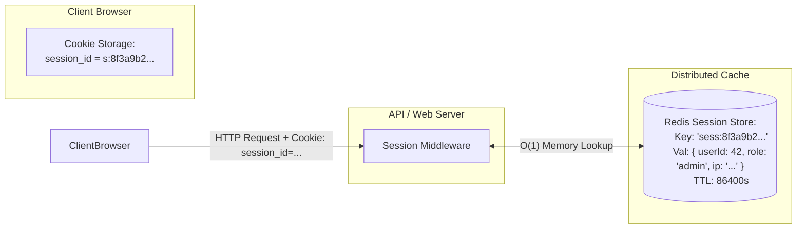
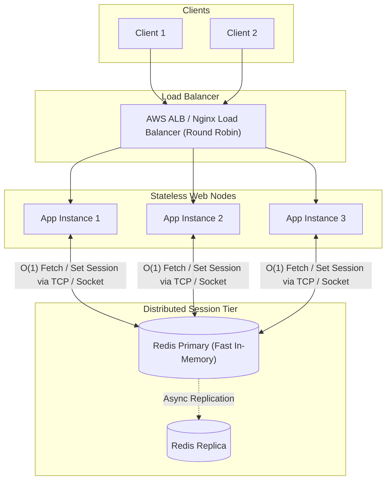

# Stateful Session-Based Authentication and Web Security: The Complete Guide

> An exhaustive engineering guide to stateful session authentication, cookie security attributes (`HttpOnly`, `Secure`, `SameSite`), distributed session stores (Redis), CSRF/XSS threat modeling, and session lifecycle management.

---

## Table of Contents
1. [What is Stateful Session-Based Authentication?](#1-what-is-stateful-session-based-authentication)
2. [End-to-End Session Lifecycle and Architecture](#2-end-to-end-session-lifecycle-and-architecture)
3. [The Cookie Security Triad and Attributes](#3-the-cookie-security-triad-and-attributes)
   - [HttpOnly: Shielding Against XSS Exfiltration](#httponly-shielding-against-xss-exfiltration)
   - [Secure: Restricting to TLS/HTTPS](#secure-restricting-to-tlshttps)
   - [SameSite: Deep Dive (Strict vs. Lax vs. None)](#samesite-deep-dive-strict-vs-lax-vs-none)
   - [Domain, Path, Max-Age, and Partitioned (CHIPS)](#domain-path-max-age-and-partitioned-chips)
4. [Scalable Session Storage Architecture](#4-scalable-session-storage-architecture)
   - [Single Server Memory (The Anti-Pattern)](#single-server-memory-the-anti-pattern)
   - [Distributed In-Memory Stores (Redis Cluster)](#distributed-in-memory-stores-redis-cluster)
5. [Threat Modeling and Attack Mitigation](#5-threat-modeling-and-attack-mitigation)
   - [Cross-Site Request Forgery (CSRF)](#cross-site-request-forgery-csrf)
   - [Session Fixation](#session-fixation)
   - [Session Hijacking and Sidejacking](#session-hijacking-and-sidejacking)
   - [Cross-Site Scripting (XSS)](#cross-site-scripting-xss)
6. [Session Invalidation and Multi-Device Management](#6-session-invalidation-and-multi-device-management)
7. [Stateful Sessions vs. Stateless Tokens (JWT): Comprehensive Trade-offs](#7-stateful-sessions-vs-stateless-tokens-jwt-comprehensive-trade-offs)
8. [Production Implementation (Node.js, Express, Redis, and CSRF Protection)](#8-production-implementation-nodejs-express-redis-and-csrf-protection)

---

## 1. What is Stateful Session-Based Authentication?

**Session-Based Authentication** is a stateful authentication model where the server is the single source of truth for user authentication state. 

Instead of embedding user claims inside a client-held token, the server generates a cryptographically random, high-entropy identifier called a **Session ID**. The full session state (User ID, roles, permissions, login timestamp) is stored on the server side (e.g., in Redis), while the client is issued only the Session ID stored inside a secure HTTP cookie.



---

## 2. End-to-End Session Lifecycle and Architecture

```mermaid
sequenceDiagram
    autonumber
    participant Client as User Browser
    participant App as Web Application Server
    participant Redis as Redis Session Cache
    participant DB as Postgres Database

    Client->>App: POST /api/auth/login { username, password }
    App->>DB: Query User & Verify Password Hash (Argon2id)
    DB-->>App: Password Valid (User ID: 42)
    
    App->>App: Generate Cryptographically Secure Session ID (256-bit CSPRNG)
    App->>Redis: SET sess:a9b8c7... { userId: 42, role: "admin" } EX 86400
    Redis-->>App: OK

    App-->>Client: 200 OK<br/>Set-Cookie: sid=s%3Aa9b8c7...; Path=/; HttpOnly; Secure; SameSite=Lax; Max-Age=86400

    Note over Client: Browser stores cookie in secure jar.<br/>Automatically attaches cookie to subsequent requests.

    Client->>App: GET /api/orders<br/>Cookie: sid=s%3Aa9b8c7...
    App->>Redis: GET sess:a9b8c7...
    Redis-->>App: { userId: 42, role: "admin" }
    App->>DB: SELECT * FROM orders WHERE user_id = 42
    DB-->>App: [ Orders Data ]
    App-->>Client: 200 OK [ Orders JSON ]
```

---

## 3. The Cookie Security Triad and Attributes

Modern browsers provide powerful security flags that must be configured on every session cookie:

```http
Set-Cookie: sid=s%3A8f3a9b2c1d4e5f6g; Path=/; Domain=.example.com; Max-Age=86400; HttpOnly; Secure; SameSite=Lax; Priority=High
```

### HttpOnly: Shielding Against XSS Exfiltration
- **Mechanics**: Instructs the browser that the cookie must **never** be exposed to client-side scripts (`document.cookie` returns empty string for this key).
- **Security Impact**: If an attacker successfully executes a Cross-Site Scripting (XSS) attack on your site, they cannot exfiltrate the session cookie via JavaScript.

---

### Secure: Restricting to TLS/HTTPS
- **Mechanics**: Instructs the browser to transmit the cookie strictly over encrypted **HTTPS (TLS)** connections.
- **Security Impact**: Prevents accidental transmission over plain HTTP, rendering the cookie immune to plaintext packet sniffing on open Wi-Fi networks.

---

### SameSite: Deep Dive (Strict vs. Lax vs. None)

The `SameSite` attribute protects web applications against **Cross-Site Request Forgery (CSRF)** by controlling whether cookies are attached to cross-site requests.

```
+-----------------------------------------------------------------------------------------------+
|                                    SameSite Behavior Matrix                                   |
+------------------+------------------------------+----------------------------+----------------+
| Request Context  | SameSite=Strict              | SameSite=Lax (Default)     | SameSite=None  |
+------------------+------------------------------+----------------------------+----------------+
| Same-Site Nav    | Sent                         | Sent                       | Sent           |
| (example.com)    |                              |                            |                |
+------------------+------------------------------+----------------------------+----------------+
| Top-Level Link   | NOT Sent                     | Sent                       | Sent           |
| (Click link from | (User appears logged out on  | (Seamless UX for incoming  |                |
|  google.com)     |  first landing)              |  links)                    |                |
+------------------+------------------------------+----------------------------+----------------+
| Cross-Site POST  | NOT Sent                     | NOT Sent                   | Sent           |
| (Attacker site   | (Immune to CSRF)             | (Immune to CSRF)           | (Requires      |
|  submits form)   |                              |                            |  CSRF Tokens)  |
+------------------+------------------------------+----------------------------+----------------+
| Cross-Site  | NOT Sent                     | NOT Sent                   | Sent           |
| / <iframe>       |                              |                            |                |
+------------------+------------------------------+----------------------------+----------------+
```

> [!IMPORTANT]
> **Production Recommendation**:
> Use `SameSite=Lax` for general consumer web applications (balances high security with smooth user navigation from search engines and emails). Use `SameSite=Strict` for ultra-sensitive portals (e.g., banking, administrative dashboards).

---

### Domain, Path, Max-Age, and Partitioned (CHIPS)

- **`Domain=.example.com`**: Allows subdomains (`app.example.com`, `billing.example.com`) to share the session.
- **`Path=/`**: Restricts the cookie to specific URL paths (usually `/`).
- **`Max-Age=86400`**: Explicit lifetime in seconds (1 day), taking precedence over legacy `Expires`.
- **`Partitioned` (CHIPS)**: Standardized for third-party embedded iframes to isolate cookies per top-level site context.

---

## 4. Scalable Session Storage Architecture

### Single Server Memory (The Anti-Pattern)
Storing sessions in server process RAM (`MemoryStore`) fails immediately in production:
- **Zero Horizontal Scalability**: Adding a second server node behind a load balancer breaks authentication (User logs into Node A, but subsequent request hits Node B $\rightarrow$ 401 Unauthorized).
- **Sticky Session Band-Aids**: Sticky sessions (routing a client to the same server IP) cause uneven load distribution and break failover.
- **Server Restarts = Mass Logout**: Redeploying or restarting the process wipes all active user sessions.

---

### Distributed In-Memory Stores (Redis Cluster)

The industry standard architecture uses a centralized **Redis Cluster** dedicated to session storage:



---

## 5. Threat Modeling and Attack Mitigation

```
+--------------------------+-----------------------------------------------------------+
| Threat Vector            | Architectural Defense Strategy                            |
+--------------------------+-----------------------------------------------------------+
| Cross-Site Request       | 1. SameSite=Lax or Strict Cookie attribute                |
| Forgery (CSRF)           | 2. Synchronizer Token Pattern (CSRF Header Validation)    |
+--------------------------+-----------------------------------------------------------+
| Session Fixation         | Regenerate Session ID immediately upon login/privilege    |
|                          | change (`req.session.regenerate()`)                       |
+--------------------------+-----------------------------------------------------------+
| Session Hijacking        | Enforce TLS 1.3, HttpOnly flag, short sliding session TTL |
+--------------------------+-----------------------------------------------------------+
| Cross-Site Scripting     | Content Security Policy (CSP), HTML entity encoding,     |
| (XSS)                    | DOMPurify sanitization, HttpOnly cookies                  |
+--------------------------+-----------------------------------------------------------+
```

### The Synchronizer Token Pattern for CSRF Defense

```mermaid
sequenceDiagram
    autonumber
    participant Browser
    participant Server

    Browser->>Server: GET /checkout
    Server-->>Browser: 200 OK (HTML includes hidden <input name="_csrf" value="rand_token_xyz">)
    
    Note over Browser: User submits payment form.<br/>Browser sends Cookie + Form Body with CSRF Token.
    
    Browser->>Server: POST /checkout/pay<br/>Cookie: sid=...<br/>Body: { amount: 100, _csrf: "rand_token_xyz" }
    
    Note over Server: Server validates that the CSRF token in body matches<br/>the cryptographic CSRF secret inside the session.
    Server-->>Browser: 200 OK (Payment Processed)
```



---

## 6. Session Invalidation and Multi-Device Management

Because session data lives on the server, stateful sessions provide **instant revocation capabilities** that stateless JWTs cannot achieve:

1. **Instant User Logout**: Delete the single `sess:<id>` key in Redis.
2. **"Log Out All Other Devices"**:
   - Store an indexed set in Redis: `user_sessions:<user_id> = [sid1, sid2, sid3]`.
   - To revoke all devices, iterate the set and delete all corresponding `sess:<sid>` records.
3. **Password Reset Revocation**: Instantly terminate all active sessions across web and mobile whenever a user resets their password or enables 2FA.

---

## 7. Stateful Sessions vs. Stateless Tokens (JWT): Comprehensive Trade-offs

| Architectural Feature | Stateful Sessions (Cookies + Redis) | Stateless Tokens (JWT / Bearer) |
| :--- | :--- | :--- |
| **State Storage** | Server-side (Redis Cluster) | Client-side (Encoded in token payload) |
| **Instant Revocation** | **Trivial**: Delete session key from Redis | **Difficult**: Requires blocklists or short TTLs |
| **Horizontal Scalability**| Requires shared Redis cluster | **Effortless**: Any node verifies signature |
| **Payload Size** | Minimal (Tiny 32-byte Session ID cookie) | Large (Headers + Claims + Signature = 500B-2KB) |
| **Mobile App Support** | Requires Cookie Jar management in SDK | Native (Stored in Secure Storage / Keychain) |
| **Cross-Domain (CORS)** | Complex cookie domain & CORS rules | Simple (`Authorization: Bearer <token>`) |
| **Security Surface** | Vulnerable to CSRF (if misconfigured) | Vulnerable to XSS token theft (if in LocalStorage)|

---

## 8. Production Implementation (Node.js, Express, Redis, and CSRF Protection)

```typescript
import express, { Request, Response, NextFunction } from 'express';
import session from 'express-session';
import { createClient } from 'redis';
import RedisStore from 'connect-redis';
import helmet from 'helmet';
import crypto from 'crypto';

const app = express();

// 1. Security Headers via Helmet
app.use(helmet());
app.use(express.json());
app.use(express.urlencoded({ extended: true }));

// 2. Initialize Redis Client
const redisClient = createClient({
  url: process.env.REDIS_URL || 'redis://localhost:6379'
});
redisClient.connect().catch(console.error);

// 3. Configure Redis Session Store
const redisStore = new RedisStore({
  client: redisClient,
  prefix: 'sess:',
  ttl: 86400 // 24 hours
});

// 4. Session Middleware Configuration
app.use(
  session({
    store: redisStore,
    name: '__Host-sid', // __Host- prefix guarantees Secure + Root Path
    secret: process.env.SESSION_SECRET || 'dev_secret_key_placeholder_for_demo_environment_only',
    resave: false,
    saveUninitialized: false,
    rolling: true, // Sliding expiration (resets TTL on active requests)
    cookie: {
      httpOnly: true, // Prevents JavaScript document.cookie access
      secure: process.env.NODE_ENV === 'production', // HTTPS only in production
      sameSite: 'lax', // Protects against cross-site CSRF
      maxAge: 1000 * 60 * 60 * 24, // 24 hours
      path: '/'
    }
  })
);

// 5. Authentication Endpoints
app.post('/api/auth/login', (req: Request, res: Response) => {
  const { username, password } = req.body;

  // In production: Validate user against DB using Argon2id
  if (username === 'alice' && password === 'ValidPassword123!') {
    // Session Fixation Defense: Always regenerate session ID upon login
    req.session.regenerate((err) => {
      if (err) return res.status(500).json({ error: 'Session regeneration failed' });

      // Attach user identity to session
      (req.session as any).user = {
        id: 'usr_42',
        username: 'alice',
        role: 'admin'
      };

      return res.status(200).json({ message: 'Login successful' });
    });
  } else {
    res.status(401).json({ error: 'Invalid credentials' });
  }
});

// Protected Profile Route
app.get('/api/user/profile', (req: Request, res: Response) => {
  const user = (req.session as any)?.user;

  if (!user) {
    return res.status(401).json({ error: 'Unauthorized: No active session' });
  }

  res.json({ user });
});

// Logout Endpoint
app.post('/api/auth/logout', (req: Request, res: Response) => {
  req.session.destroy((err) => {
    if (err) return res.status(500).json({ error: 'Failed to destroy session' });
    res.clearCookie('__Host-sid', { path: '/' });
    res.json({ message: 'Logged out successfully' });
  });
});
```

---

> [!TIP]
> **Summary: Best Practices for Stateful Session Authentication**:
> - Always use `HttpOnly`, `Secure`, and `SameSite=Lax` cookie flags.
> - Use the `__Host-` cookie prefix in production for maximum domain isolation.
> - Store session records in a distributed **Redis cluster** with explicit TTLs.
> - Always call `session.regenerate()` immediately after authentication to prevent **Session Fixation**.
