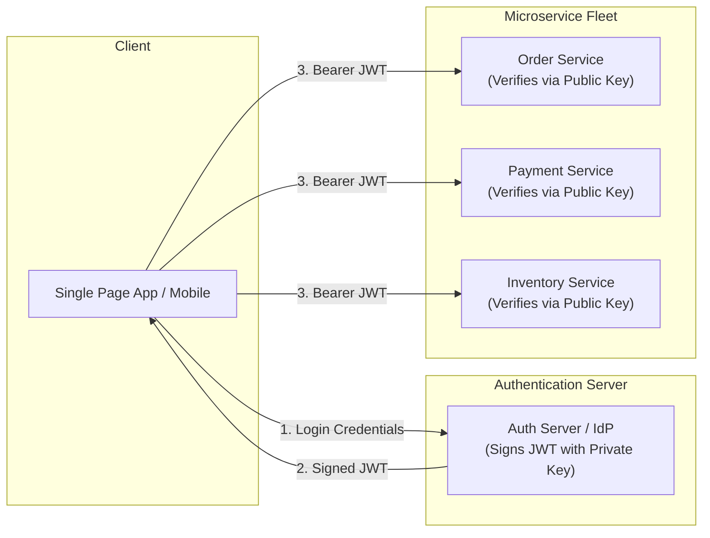
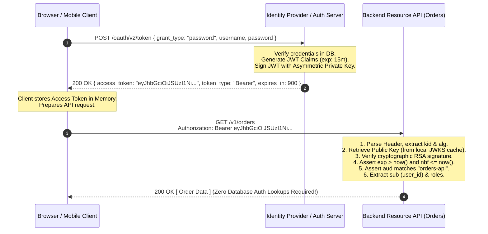
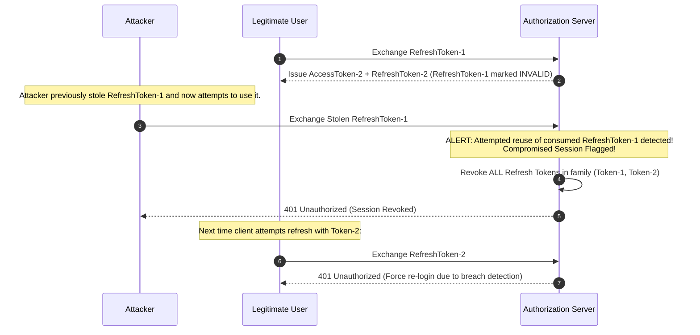
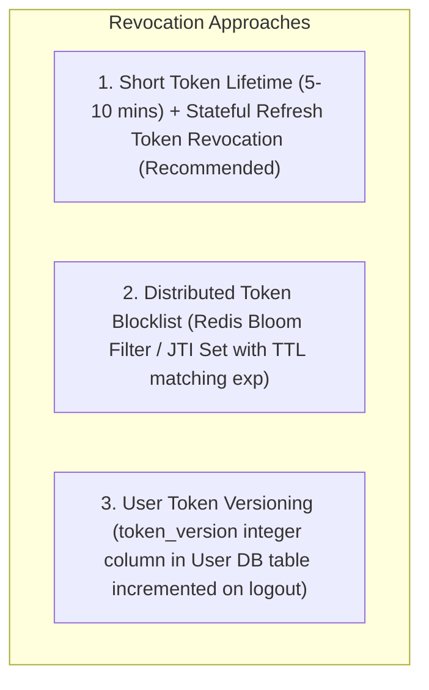
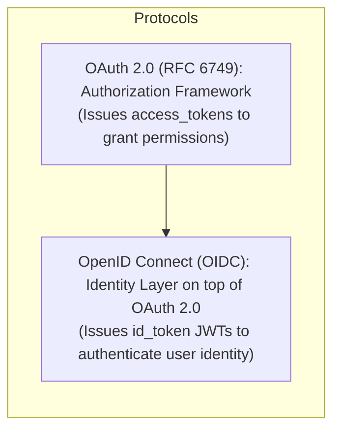

# Stateless Token-Based Authentication, JSON Web Tokens (JWT), and OAuth 2.0 / OIDC: The Complete Architecture Guide

> An exhaustive, production-grade guide to stateless token authentication, JSON Web Tokens (RFC 7519), asymmetric key signing (RS256/ES256), the Dual-Token Access/Refresh lifecycle with Rotation (RTR), storage security, attack vector mitigations, and OAuth 2.0 / OIDC protocols.

---

## Table of Contents
1. [What is Stateless Token-Based Authentication?](#1-what-is-stateless-token-based-authentication)
2. [Deep Dive: JSON Web Token (JWT - RFC 7519) Anatomy](#2-deep-dive-json-web-token-jwt---rfc-7519-anatomy)
   - [Header (JOSE Header)](#header-jose-header)
   - [Payload (Claims Matrix)](#payload-claims-matrix)
   - [Signature (Symmetric vs. Asymmetric Signing)](#signature-symmetric-vs-asymmetric-signing)
   - [Base64URL Encoding vs. Encryption (JWS vs. JWE)](#base64url-encoding-vs-encryption-jws-vs-jwe)
3. [End-to-End JWT Authentication & Verification Flow](#3-end-to-end-jwt-authentication--verification-flow)
4. [The Dual-Token Pattern: Access Token + Refresh Token Lifecycle](#4-the-dual-token-pattern-access-token--refresh-token-lifecycle)
   - [Refresh Token Rotation (RTR) and Automatic Reuse Detection](#refresh-token-rotation-rtr-and-automatic-reuse-detection)
5. [Client-Side Token Storage Security Matrix](#5-client-side-token-storage-security-matrix)
6. [Critical JWT Vulnerabilities and Attack Vectors](#6-critical-jwt-vulnerabilities-and-attack-vectors)
   - [The "None" Algorithm Attack](#the-none-algorithm-attack)
   - [Key Confusion Attack (RS256 to HS256 Downgrade)](#key-confusion-attack-rs256-to-hs256-downgrade)
   - [Weak HMAC Secrets and Brute-Force Cracking](#weak-hmac-secrets-and-brute-force-cracking)
   - [The Stateless Revocation Problem and Solutions](#the-stateless-revocation-problem-and-solutions)
7. [OAuth 2.0 and OpenID Connect (OIDC) Architectural Foundations](#7-oauth-20-and-openid-connect-oidc-architectural-foundations)
8. [Production Implementation (Node.js, TypeScript, RS256, and JWKS)](#8-production-implementation-nodejs-typescript-rs256-and-jwks)

---

## 1. What is Stateless Token-Based Authentication?

In **Token-Based Authentication**, authentication state is decoupled from server-side session memory. Instead of storing session records in a database or Redis cluster, the server issues a cryptographically signed, self-contained token (**JSON Web Token / JWT**) directly to the client.

The client presents this token in the HTTP `Authorization: Bearer <token>` header with every subsequent API request. Any server, microservice, or serverless function possessing the public key or shared secret can **cryptographically verify** the token's authenticity and extract user permissions without querying a database.



---

## 2. Deep Dive: JSON Web Token (JWT - RFC 7519) Anatomy

A JWT is a compact, URL-safe string consisting of three distinct segments separated by periods (`.`):

$$\text{JWT} = \underbrace{\text{Base64URL}(\text{Header})}_{\text{Algorithm \& Metadata}} \;\boldsymbol{.}\; \underbrace{\text{Base64URL}(\text{Payload})}_{\text{Claims \& Data}} \;\boldsymbol{.}\; \underbrace{\text{Base64URL}(\text{Signature})}_{\text{Cryptographic Proof}}$$

```
eyJhbGciOiJSUzI1NiIsInR5cCI6IkpXVCIsImtpZCI6IjIwMjYtMDkta2V5LTEifQ.eyJzdWIiOiJ1c3JfNDIiLCJyb2xlIjoiYWRtaW4iLCJleHAiOjE3MzU2ODkwMDB9.i8xN2p9...
\___________________________________/ \______________________________________________/ \________________________________________________/
               HEADER                                     PAYLOAD                                            SIGNATURE
```

---

### Header (JOSE Header)
Specifies the cryptographic algorithm and token metadata:

```json
{
  "alg": "RS256",
  "typ": "JWT",
  "kid": "auth-key-2026-v1"
}
```
- `alg`: The cryptographic signing algorithm (e.g., `HS256`, `RS256`, `ES256`, `EdDSA`).
- `typ`: Token type (`"JWT"`).
- `kid` (Key ID): Identifies which key was used to sign the token (critical for zero-downtime key rotation via JWKS).

---

### Payload (Claims Matrix)

The payload contains **Claims** (statements about the entity/user and additional metadata).

```json
{
  "iss": "https://auth.example.com",
  "sub": "usr_998877",
  "aud": "https://api.example.com/v1",
  "exp": 1735689600,
  "nbf": 1735686000,
  "iat": 1735686000,
  "jti": "d6a3f9e2-8c11-4f7b-9e4a-5b6c7d8e9f0a",
  "tenant_id": "org_enterprise_42",
  "roles": ["admin", "billing_manager"],
  "email": "alice@example.com"
}
```

#### RFC 7519 Standard Registered Claims
- **`iss` (Issuer)**: URL or identifier of the issuing authority.
- **`sub` (Subject)**: Unique identifier of the user/entity (User ID).
- **`aud` (Audience)**: The intended recipient/API resource of the token.
- **`exp` (Expiration Time)**: Unix epoch timestamp after which the token is invalid.
- **`nbf` (Not Before)**: Unix epoch timestamp before which the token must not be accepted.
- **`iat` (Issued At)**: Unix epoch timestamp when the token was created.
- **`jti` (JWT ID)**: Unique identifier for the token (used to prevent replay attacks).

---

### Signature (Symmetric vs. Asymmetric Signing)

```
+------------------------------------+------------------------------------+
| Symmetric (HMAC: HS256 / HS512)    | Asymmetric (RSA/ECDSA: RS256/ES256)|
+------------------------------------+------------------------------------+
| Single Shared Secret Key used for  | Private Key signs the token;       |
| both signing and verification.     | Public Key verifies the token.     |
|                                    |                                    |
| PRO: Fast and computationally light| PRO: Microservices only need the   |
| CON: Every microservice verifying  |      public key; Private key stays |
|      the token knows the secret    |      safely isolated in HSM/Auth.  |
|      and could forge tokens.       | CON: Slightly higher CPU overhead. |
+------------------------------------+------------------------------------+
```

#### Mathematical Signature Formulas

- **Symmetric (HS256)**:
  $$\text{Signature} = \text{HMAC-SHA256}(\text{Header}_{\text{b64}} + "." + \text{Payload}_{\text{b64}}, \;\text{SharedSecret})$$
- **Asymmetric (RS256)**:
  $$\text{Signature} = \text{RSA-SHA256-Sign}(\text{Header}_{\text{b64}} + "." + \text{Payload}_{\text{b64}}, \;\text{PrivateKey})$$

---

### Base64URL Encoding vs. Encryption (JWS vs. JWE)

> [!CAUTION]
> **Standard JWTs (JSON Web Signatures / JWS) are SIGNED, NOT ENCRYPTED.**
> Anyone who intercepts a JWT can decode the Base64URL payload and read all user claims. 
> 
> **Never store sensitive data (plaintext passwords, Social Security Numbers, credit card numbers) in standard JWT claims.** If payload encryption is required, use **JSON Web Encryption (JWE - RFC 7516)**.

---

## 3. End-to-End JWT Authentication & Verification Flow



---

## 4. The Dual-Token Pattern: Access Token + Refresh Token Lifecycle

Stateless access tokens have an inherent trade-off: **once issued, a stateless token cannot be easily revoked until it naturally expires**.

The industry standard solution is the **Dual-Token Pattern**:
1. **Access Token**: Short-lived (5 to 15 minutes), stateless JWT used for accessing API endpoints.
2. **Refresh Token**: Long-lived (7 to 30 days), stateful opaque string or token stored securely in the Auth Server/Redis. Used exclusively to obtain fresh access tokens.

```mermaid
flowchart TD
    subgraph Access Token (Short-Lived: 10 mins)
        AT["Stateless JWT"] --> AccessAPIs["Directly accesses microservice APIs without DB lookups"]
        AT --> Expire["Expires quickly -> Minimizes blast radius if leaked"]
    end

    subgraph Refresh Token (Long-Lived: 14 days)
        RT["Stateful Opaque Token in HttpOnly Cookie"] --> AuthCheck["Sent ONLY to /auth/refresh endpoint"]
        AuthCheck --> DBCheck["Auth Server validates against DB/Redis (Can be instantly revoked)"]
    end
```

---

### Refresh Token Rotation (RTR) and Automatic Reuse Detection

**Refresh Token Rotation (RTR)** is a security standard where the authorization server issues a brand-new refresh token every time an existing one is exchanged, invalidating the old one.

If an attacker intercepts a refresh token and uses it *after* the legitimate user has already exchanged it, the server detects **Token Reuse** and immediately revokes the entire token family, logging out the attacker and the victim:



---

## 5. Client-Side Token Storage Security Matrix

```
+---------------------+-------------------+-------------------+-----------------------------------+
| Storage Location    | XSS Vulnerability | CSRF Vulnerability| Persistence                       |
+---------------------+-------------------+-------------------+-----------------------------------+
| LocalStorage /      | CRITICAL          | ZERO              | Persists permanently across tabs  |
| SessionStorage      | (JS can steal)    |                   | and browser restarts              |
+---------------------+-------------------+-------------------+-----------------------------------+
| Browser Memory      | SAFE              | ZERO              | Wiped on page refresh / tab close |
| (React State/Redux) | (No persistence)  |                   |                                   |
+---------------------+-------------------+-------------------+-----------------------------------+
| HttpOnly, Secure    | SAFE              | LOW TO MEDIUM     | Managed automatically by browser  |
| SameSite=Lax Cookie | (JS cannot read)  | (Handled by Lax)  | cookies                           |
+---------------------+-------------------+-------------------+-----------------------------------+
```

### The Gold Standard Storage Pattern for Single Page Applications (SPAs)
- **Access Token**: Stored in **Application Memory (JavaScript variable / React State)**.
- **Refresh Token**: Stored in a **`Secure`, `HttpOnly`, `SameSite=Lax` Cookie** scoped exclusively to `/api/auth/refresh`.
- **Silent Refresh**: On initial page load or token expiration, the SPA makes a background call to `/api/auth/refresh` to restore the in-memory access token seamlessly.

---

## 6. Critical JWT Vulnerabilities and Attack Vectors

### The "None" Algorithm Attack
- **Vulnerability**: Early or naive JWT libraries allowed `{"alg": "none"}`. Attackers stripped the signature, altered `{"role": "admin"}` in the payload, set `alg: "none"`, and bypassed authentication entirely.
- **Mitigation**: Strictly whitelist allowed algorithms in verification options (`algorithms: ['RS256']`). Never dynamically accept the algorithm header from the untrusted token.

---

### Key Confusion Attack (RS256 to HS256 Downgrade)
- **Vulnerability**: An attacker takes an API using asymmetric **RS256**, extracts the server's publicly available RSA Public Key, and signs a malicious token using symmetric **HS256** using the RSA Public Key string as the HMAC secret! If the backend verification function blindly uses the public key for HMAC verification, the forged signature will validate.
- **Mitigation**: Enforce explicit key-to-algorithm binding. Never pass an RSA public key to an HMAC verification routine.

---

### Weak HMAC Secrets and Brute-Force Cracking
- **Vulnerability**: If an API signs tokens using `HS256` with a simple secret like `"secret"` or `"password123"`, attackers can capture a JWT from headers and crack the secret offline using tools like **Hashcat** or **John the Ripper** at billions of guesses per second.
- **Mitigation**: Use high-entropy symmetric secrets (minimum 256 bits of cryptographically secure random bytes) or migrate to asymmetric **RS256 / ES256**.

---

### The Stateless Revocation Problem and Solutions

How do you revoke a stateless JWT before its expiration timestamp if a user is fired or their account is compromised?



---

## 7. OAuth 2.0 and OpenID Connect (OIDC) Architectural Foundations



### Key OAuth 2.0 Roles
1. **Resource Owner**: The end-user granting access to their data.
2. **Client**: The third-party application requesting access (e.g., mobile app, web app).
3. **Authorization Server**: Issues tokens upon authenticating the Resource Owner (e.g., Auth0, Okta, Google Identity).
4. **Resource Server**: The API hosting protected user resources.

### Modern Best Practice Flow: Authorization Code Flow with PKCE
The **Proof Key for Code Exchange (PKCE - RFC 7636)** prevents authorization code interception attacks on public clients (mobile apps and SPAs) by dynamically generating a cryptographic code verifier and code challenge for every login request.

---

## 8. Production Implementation (Node.js, TypeScript, RS256, and JWKS)

```typescript
import jwt, { JwtPayload, SignOptions } from 'jsonwebtoken';
import express, { Request, Response, NextFunction } from 'express';
import jwksClient from 'jwks-rsa';
import crypto from 'crypto';

// ==========================================
// 1. Asymmetric Key Pair Generation Demo
// ==========================================
const { privateKey, publicKey } = crypto.generateKeyPairSync('rsa', {
  modulusLength: 2048,
  publicKeyEncoding: { type: 'spki', format: 'pem' },
  privateKeyEncoding: { type: 'pkcs8', format: 'pem' }
});

const ISSUER = 'https://auth.example.com';
const AUDIENCE = 'https://api.example.com';
const KEY_ID = 'key_2026_prod_1';

// ==========================================
// 2. Token Issuance Function
// ==========================================
export function issueAccessToken(userId: string, roles: string[]): string {
  const payload = {
    sub: userId,
    roles,
    tenant_id: 'org_enterprise_99'
  };

  const signOptions: SignOptions = {
    algorithm: 'RS256',
    expiresIn: '15m',
    issuer: ISSUER,
    audience: AUDIENCE,
    keyid: KEY_ID
  };

  return jwt.sign(payload, privateKey, signOptions);
}

// ==========================================
// 3. JWT Verification Middleware
// ==========================================
export interface AuthenticatedUserRequest extends Request {
  user?: JwtPayload | string;
}

export function verifyJwtMiddleware(req: AuthenticatedUserRequest, res: Response, next: NextFunction) {
  const authHeader = req.headers['authorization'];

  if (!authHeader || !authHeader.startsWith('Bearer ')) {
    return res.status(401).json({
      type: 'https://api.example.com/errors/missing-token',
      title: 'Unauthorized',
      status: 401,
      detail: 'Missing or malformed Authorization header. Expected: Bearer <token>'
    });
  }

  const token = authHeader.substring(7).trim();

  // Strict verification: explicitly define allowed algorithms, issuer, and audience
  jwt.verify(
    token,
    publicKey,
    {
      algorithms: ['RS256'], // Explicitly whitelist RS256 (Defends against algorithm confusion)
      issuer: ISSUER,
      audience: AUDIENCE
    },
    (err, decoded) => {
      if (err) {
        return res.status(401).json({
          type: 'https://api.example.com/errors/invalid-token',
          title: 'Invalid or Expired Token',
          status: 401,
          detail: err.message
        });
      }

      req.user = decoded;
      next();
    }
  );
}

// ==========================================
// 4. Role-Based Access Control (RBAC) Guard
// ==========================================
export function requireRole(requiredRole: string) {
  return (req: AuthenticatedUserRequest, res: Response, next: NextFunction) => {
    const user = req.user as JwtPayload;

    if (!user || !Array.isArray(user.roles) || !user.roles.includes(requiredRole)) {
      return res.status(403).json({
        type: 'https://api.example.com/errors/insufficient-permissions',
        title: 'Forbidden',
        status: 403,
        detail: `Access requires the '${requiredRole}' role.`
      });
    }

    next();
  };
}

// ==========================================
// 5. Express Route Registration
// ==========================================
const app = express();
app.use(express.json());

// Issue Token Route
app.post('/auth/login', (req, res) => {
  // Assume user credentials verified...
  const token = issueAccessToken('usr_123456', ['admin', 'editor']);
  res.json({ access_token: token, token_type: 'Bearer', expires_in: 900 });
});

// Protected Resource Route
app.get('/api/admin/reports', verifyJwtMiddleware, requireRole('admin'), (req, res) => {
  res.json({ message: 'Access granted to confidential administrative reports.', user: (req as any).user });
});
```

---

> [!TIP]
> **Summary: Production Checklist for Stateless JWT Architectures**:
> - ✅ Always sign tokens with asymmetric algorithms (**RS256** or **ES256**) in distributed systems.
> - ✅ Keep Access Tokens short-lived (**5-15 minutes**) and use **Refresh Token Rotation (RTR)** with reuse detection.
> - ✅ Explicitly validate `iss`, `aud`, `exp`, and restrict `algorithms: ['RS256']` during verification.
> - ✅ Never store secrets or sensitive PII inside unencrypted JWT payloads.
> - ✅ Store Access Tokens in application memory and Refresh Tokens in `HttpOnly`, `Secure`, `SameSite=Lax` cookies.
